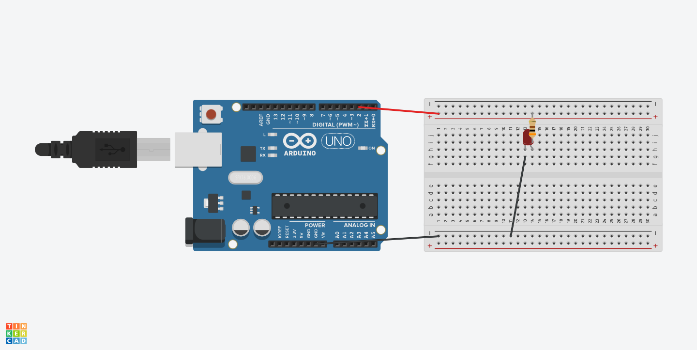

# VozPiscaLed: Controle um LED com Arduíno via Comandos de Voz no Browser

Este é um projeto experimental que demonstra como controlar um LED conectado a uma placa Arduíno utilizando comandos de voz diretamente de um navegador web. A aplicação web, desenvolvida em Angular, utiliza a biblioteca [Transformers.js](https://huggingface.co/docs/transformers.js/index) para executar o modelo de reconhecimento de fala [Whisper (tiny)](https://huggingface.co/Xenova/whisper-tiny) localmente, transcrevendo o áudio do usuário em tempo real. O comando é então enviado ao Arduíno através da [Web Serial API](https://developer.mozilla.org/en-US/docs/Web/API/Web_Serial_API).

## 🎥 Demonstração Rápida

TODO...

## ✨ Features

  * **Transcrição de Áudio no Browser:** Reconhecimento de fala executado 100% no cliente, sem a necessidade de enviar áudio para um servidor, garantindo privacidade e baixa latência.
  * **Controle de Hardware via Web:** Comunicação direta entre a aplicação web e o Arduíno via USB.
  * **Interface Simples e Reativa:** Construído com Angular e Angular Material para uma experiência de usuário limpa.

## 🛠️ Tecnologias Utilizadas

### Frontend (Aplicação Web)

  * **Framework:** [Angular](https://angular.io/)
  * **UI Components:** [Angular Material](https://material.angular.io/)
  * **IA / Machine Learning:** [Transformers.js](https://huggingface.co/docs/transformers.js/index)
  * **Modelo de IA:** [Xenova/whisper-tiny](https://huggingface.co/Xenova/whisper-tiny)
  * **Comunicação com Hardware:** [Web Serial API](https://developer.mozilla.org/en-US/docs/Web/API/Web_Serial_API)

### Hardware

  * **Placa:** Arduíno (Uno)
  * **Componentes:** 1x LED, 1x Resistor (300Ω)
  * **IDE:** [Arduíno IDE](https://www.arduino.cc/en/software)

## 📋 Pré-requisitos

Antes de começar, certifique-se de que você tem o seguinte instalado:

1.  **Navegador com suporte à Web Serial API:** Google Chrome, Microsoft Edge ou Opera.
2.  **[Node.js e npm](https://nodejs.org/)**: Versão 18 ou superior.
3.  **[Angular CLI](https://angular.io/cli)**: `npm install -g @angular/cli`
4.  **[Arduíno IDE](https://www.arduino.cc/en/software)**: Para carregar o código na placa.

## 🚀 Guia de Instalação e Execução

Siga estes passos para ter o projeto rodando localmente.

### 1\. Hardware (Circuito Arduíno)

Monte o circuito conforme a imagem abaixo. Conecte o pino positivo (anodo, perna mais longa) do LED à porta digital `2` do Arduíno através do resistor de 300Ω. Conecte o pino negativo (catodo, perna mais curta) ao pino GND.




### 2\. Arduíno (Sketch)

1.  Conecte sua placa Arduíno ao computador via USB.
2.  Abra o arquivo do sketch `sketchs/comando_serial/comando_serial.ino` na Arduíno IDE.
3.  Selecione a placa e a porta serial corretas no menu `Ferramentas`.
4.  Clique no botão "Carregar" (seta para a direita) para enviar o código para o Arduíno.

### 3\. Aplicação Web (Frontend)

1.  Clone o repositório:

    ```bash
    git clone https://github.com/alexbispo/voz-pisca-led.git
    ```

2.  Navegue até o diretório do projeto:

    ```bash
    cd voz-pisca-led
    ```

3.  Instale as dependências:

    ```bash
    npm install
    ```

4.  Inicie o servidor de desenvolvimento:

    ```bash
    ng serve
    ```

5.  Abra seu navegador (Chrome, Edge) e acesse `http://localhost:4200/`.

## 🎤 Como Usar

1.  Ao abrir a aplicação, clique no botão **"Conectar Serial"**. Uma janela do navegador irá aparecer para você selecionar a porta serial à qual o Arduíno está conectado.
2.  Após a conexão ser estabelecida, clique no botão **"Gravar"**. O navegador poderá solicitar permissão para usar o microfone.
3.  Fale um comando, e quando terminar de falar clisue no botão **"Parar"**. O modelo Whisper irá transcrever sua fala.
4.  Palavras-chave como **"liga"**, **"olá"** ou **"ligar"** enviarão o comando `ON` para o Arduíno, acendendo o LED.
5.  Palavras-chave como **"desliga"**, **"desligar"** ou **"tchau"** enviarão o comando `OFF`, apagando o LED.

## 🧠 Como Funciona (Arquitetura)

O fluxo de dados e processamento ocorre da seguinte forma:

1.  **Captura de Áudio**: O navegador captura o áudio do microfone do usuário.
2.  **Prepara o audio capturado**: O modelo `whisper-tiny`  espera a entrada em um formato específico, então o audio capturado é transformado para atender ao formato exigido pelo modelo.
3.  **Transcrição (Speech-to-Text)**: O áudio é processado pela biblioteca `Transformers.js` que executa o modelo `whisper-tiny` localmente para converter a fala em texto.
4.  **Interpretação de Comando**: A aplicação Angular analisa o texto transcrito usando uma expressão regular (Regex) para identificar as palavras-chave de ativação (`ligar`, `desligar`, etc.).
5.  **Comunicação Serial**: Ao encontrar uma palavra-chave, a aplicação envia o comando correspondente (`ON` ou `OFF`) para o Arduíno através da Web Serial API.
6.  **Ação no Hardware**: O sketch no Arduíno está em um loop, lendo a porta serial. Ao receber um comando, ele altera o estado da porta digital 2, ligando ou desligando o LED.

## 💡 Possíveis Melhorias e Próximos Passos

Este é um projeto base com muito espaço para evolução. Algumas ideias:

  * **Intenção e Entidades**: Substituir o Regex por uma análise de intenção mais robusta. Seria possível usar um modelo de linguagem menor (como um de classificação de texto) para entender frases mais complexas como "por favor, acenda a luz vermelha".
  * **Mais Comandos**: Adicionar comandos para piscar o LED (`blink`), controlar a intensidade com PWM, ou até mesmo controlar um LED RGB, mudando suas cores por voz.
  * **Feedback Visual**: Melhorar a interface para mostrar o status da conexão, o texto transcrito em tempo real e qual comando foi enviado.
  * **Agente de IA**: Evoluir este conceito para um "agente". O agente poderia receber um objetivo mais complexo ("crie um padrão de luzes de festa") e então decidir a sequência de comandos a serem enviados (`ON`, `OFF`, `WAIT`, etc.).

Criado com 🧠 por **Alex Bispo**.
